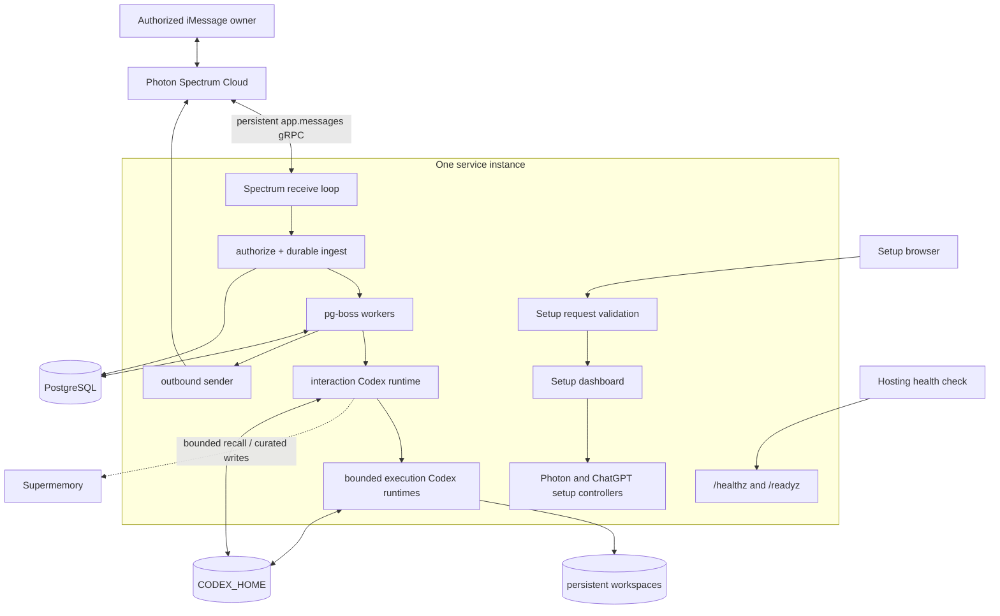
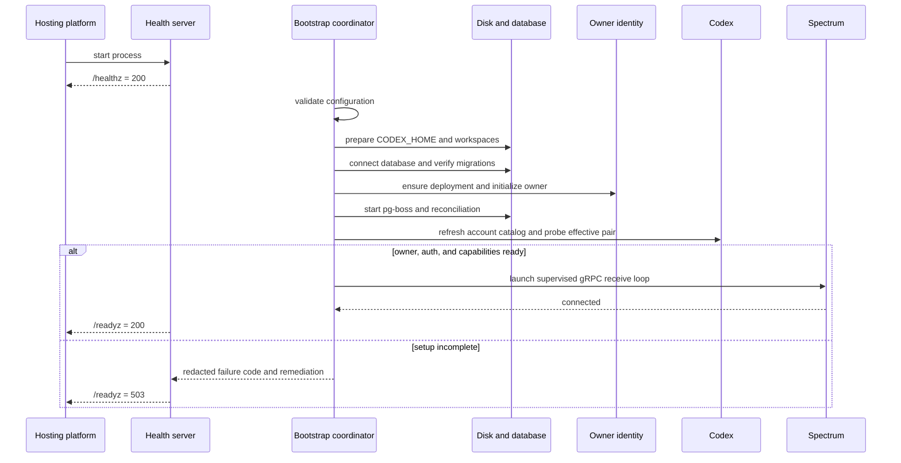
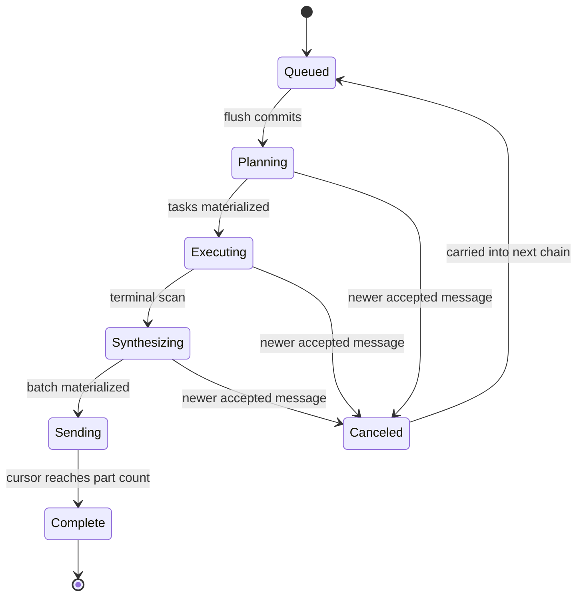

# Architecture

## 1. Status and integration boundary

The target is one long-running Node.js service with three concurrent responsibilities:

1. consume iMessage events from Spectrum Cloud’s persistent `app.messages` gRPC stream;
2. run the durable inbound, Codex, outbound, and memory jobs backed by PostgreSQL/pg-boss; and
3. expose liveness and readiness endpoints to the hosting environment.

The branch composes the provider, database, queue, Codex, memory, storage, health, and shutdown modules into that topology. `src/index.ts` exposes `startAgentService()` and an injected `AgentServiceBootstrap`; `src/runtime/production-bootstrap.ts` supplies the production adapters; and `src/server.ts`, used by `npm run dev` and `npm start`, starts the composed lifecycle.

This distinction is an intentional release boundary:

| Layer | Current branch |
|---|---|
| Container build and runtime | Present in `Dockerfile`; infrastructure is provisioned by the operator |
| Persistent storage preparation | Composed as an injectable startup stage |
| Full health/readiness server | Used by `src/server.ts`; reports the composed operational stages |
| Boot and graceful-shutdown ordering | Implemented as an injectable composition boundary |
| Spectrum, PostgreSQL, Codex, and Supermemory modules | Composed with fake/unit/integration coverage |
| Authorized receive through plan/execute/synthesize/send | Composed into the executable entrypoint; protected live path untested |
| Clean local and hosted first-message evidence | Not established |
| Live Photon, Codex, hosting, or Supermemory evidence | Not run for this release |

The remainder of this document describes the composition contract and identifies where implementation evidence stops.

## 2. Deployed topology



The deployment requires:

- one long-running service instance;
- one PostgreSQL database configured through a secret `DATABASE_URL`;
- one persistent volume mounted at `/data`;
- `CODEX_HOME=/data/codex` and `AGENT_WORKSPACE_ROOT=/data/workspaces`;
- an explicit stable `DEPLOYMENT_ID` and `APP_ENCRYPTION_KEY`;
- checked-in migrations applied by startup, with `npm run db:migrate` available as a release command; and
- a host shutdown grace period that allows the application's bounded stop hooks to finish.

The disk makes v1 single-instance. PostgreSQL is independently durable and remains the operational source of truth. The disk is for Codex credentials/session files and workspaces, not queue truth.

## 3. Ownership and trust boundaries

```text
PostgreSQL                              Persistent disk
------------------------------------    ---------------------------------
Accepted inbound/outbound content       CODEX_HOME config/auth/sessions
Sender and space routing                Agent workspaces and artifacts
Chains, tasks, versions, cancellation
Approvals and failure events             Supermemory
Outbound parts and send cursor           ---------------------------------
Codex thread IDs and summaries           Curated durable facts/summaries
Memory operation receipts                Bounded semantic recall
```

These boundaries are non-interchangeable:

- PostgreSQL is required for authorization state, queueing, idempotency, delivery, and recovery.
- Supermemory is optional at turn time and cannot authorize, approve, route, or acknowledge a message.
- `CODEX_HOME` contains private credentials and must use file-backed storage with directory mode `0700` and config/auth mode `0600` where supported.
- `AGENT_WORKSPACE_ROOT` must be an absolute path separate from and non-overlapping with `CODEX_HOME`.
- Unknown senders must be rejected before any model or child-process call.
- Model, repository, memory, web, and tool content are untrusted data. A model cannot broaden its permission profile or approve an action.

State-changing setup requests require an exact same-origin `Origin` and reject
cross-site fetch metadata. Owner status and rendered pages contain only the
masked owner phone; submitted raw numbers are never echoed. Provider
credentials, database credentials, Codex credentials, and unrestricted errors
stay server-side.

`DeploymentIdentityController` can exist before PostgreSQL is connected. After migrations, `OperationalRepository.ensureDeployment()` creates the deployment and primary owner without a channel identity, then the controller binds to the repository. An active database identity wins; only when none exists may one valid legacy environment phone be imported. Stored Photon metadata is never an authorization source. The controller serializes replacements, exposes masked state, and notifies activation only after persistence succeeds. Replacing the owner increments the owner's binding revision in the same transaction and invalidates the prior Photon binding.

## 4. Boot sequence

The final composition boundary starts the HTTP listener first so the process can remain live while setup is incomplete.



The ordered startup stages in `startAgentService()` are:

1. listen on HTTP;
2. validate configuration, including rejection of unsupported legacy keys;
3. prepare the two persistent directories and Codex config;
4. connect PostgreSQL;
5. apply or verify migrations;
6. ensure the deployment, bind the owner identity repository, and import one valid legacy owner only when no database identity exists;
7. resume or import a durable Photon installation and require its validated owner revision to equal the current owner revision;
8. start pg-boss workers once and reconcile every durable queue stage;
9. refresh Codex account capabilities through `ModelSettingsService`, resolve the effective model pair, and
   probe only that pair;
10. configure optional Supermemory; and
11. let `ActivationCoordinator` start the restartable Spectrum intake only when owner identity, current-revision Photon, Codex auth, and capabilities are ready.

Queue workers are one-time process infrastructure. Spectrum intake is a separate restartable run owned by `ActivationCoordinator`. Capability, Photon, or owner loss stops the current intake; recovery starts at most one replacement; and restart exhaustion clears the active run ID before entering bounded recovery. Durable-pipeline reconciliation completes before normal intake is accepted.

Missing or expired ChatGPT auth is a setup state, not a crash loop. Liveness remains healthy, readiness stays false, and Spectrum execution is not started. In ChatGPT mode the user reconnects through the dashboard device-code flow; `npm run codex:login` and `npm run codex:status` in the private service shell remain recovery tools using the same persistent `CODEX_HOME`. In API-key mode readiness requires `OPENAI_API_KEY`; the key is copied only into the explicit Codex child environment.

`ModelSettingsService` is the only subscriber to account-capability events and the only domain component that persists the refreshed catalog. The HTTP controller maps domain failures into route-specific errors. ChatGPT account `model/list` is the authority for the Advanced picker and
supported reasoning efforts; `account/read` and `account/updated` supply only
displayed plan metadata. PostgreSQL stores GPT-5.6 Luna / High as the default
preference separately from the effective pair. If the exact preference is not
advertised, Codex's advertised default model and effort become effective
without overwriting the preference.

## 5. Message pipeline

### 5.1 Receive

The Spectrum loop consumes native provider values:

```ts
for await (const [space, message] of app.messages) {
  // narrow, authorize, persist, and enqueue only
}
```

The loop ignores non-iMessage events, outbound echoes, unsupported content, and invalid sender/space values. An injected `authorizeAndIngest()` boundary must deterministically authorize the normalized sender before durable ingest. Codex and Supermemory never run inline in the receive loop.

### 5.2 Persist and debounce

For each accepted text:

1. insert the message under a unique provider message ID;
2. preserve Spectrum space GUID and route phone for restart lookup;
3. supersede the active interruptible chain when appropriate; and
4. upsert the per-space `inbound.flush` job for the debounce deadline.

If queue scheduling fails after insert, the message remains durable. Reconciliation finds spaces with undrained input and re-creates the singleton flush.

### 5.3 Flush

The flush transaction drains undrained and carried messages in order, creates a versioned chain with the deployment's current effective model/effort snapshot, captures the principal and every authorized contributor identity reference, cancels the stale chain, and enqueues one `turn.plan` job. Queue payloads contain identifiers and expected versions/states, not raw personal content. A later dashboard change affects the next chain and cannot change running work.

### 5.4 Plan

The `turn.plan` handler:

1. verify the chain ID, version, and current state;
2. load authoritative history from PostgreSQL;
3. optionally recall bounded, owner-scoped Supermemory context;
4. load the exact model/effort snapshot from the chain;
5. load the chain authorization reference and run the interaction Codex thread through `SecureStructuredCodexRunner`; and
6. either materialize a direct response or enqueue bounded execution tasks.

The production composition registers this handler with its prompt bundle,
durable repositories, queue publisher, optional memory recall, and outbound
status transport. The interaction model cannot select a harness model through
structured output. Offline tests cover those boundaries; protected
live-provider execution remains a separate release check. The runner reloads current identity and deployment state immediately before every normal or missing-session recovery call. Revocation, invalid references, unavailable ownership, and task-rate denial become terminal, non-retryable chain transitions and start no Codex child.

### 5.5 Execute

Each `task.execute` handler re-checks chain/task state, re-resolves the current workspace capability at claim time, resolves the code-owned workspace path, restricts the task to the binding's authorized permission-profile set, creates a minimal child environment, and runs through the same secure queued boundary with timeout/cancellation/output bounds. It validates `ExecutionResult` and persists a terminal task result or exact approval proposal. Production seeds the `personal` workspace binding; user text cannot create bindings or broaden its profile set.

Execution agents cannot message the owner or consume their own approval. Their
results return through synthesis. Every task loads the parent chain's persisted
model pair; there is no task-complexity router or automatic escalation. The
production composition registers the durable execution worker with bounded
concurrency, cancellation, prompts, and the shared orchestration repository.

### 5.6 Synthesize

The singleton `turn.synthesize` handler loads terminal task results and the same
chain model pair, preserves truthful partial failures, requires confirmation
for consequential operations, produces the final user-facing response, and
materializes every outbound part before sending. The production composition
registers this worker and the outbound sender against the same durable
repository and queue.

### 5.7 Send

`outbound.send` rehydrates the native Spectrum space using its stored GUID and route phone, claims the next materialized part, sends it with a stable client GUID, and advances the database cursor only after acknowledgement.

```ts
clientGuid = sha256(`${deploymentId}:${outboundBatchId}:${position}`)
```

A crash after provider acknowledgement but before cursor persistence retries the same GUID. The transport receives the same idempotency key while PostgreSQL remains authoritative about the next part.

### 5.8 Memory projection

Direct, task, and synthesis commits persist encrypted memory candidates in their successful database transaction. After chain completion, the central `memory.curate` queue projects them asynchronously. It filters temporary, low-confidence, or secret-like candidates; hashes content for deduplication; namespaces by internal deployment/owner IDs; writes through a bounded provider client; and records receipts in PostgreSQL. Queue-publication or provider failure does not change the completed operational response: outbound completion and restart reconciliation republish missing work.

### 5.9 Approvals

A `needs_approval` task completion persists the immutable encrypted proposal and publishes `approval.request`. Only an authorized owner response in the allowed space can approve or reject it. Approval consumption atomically binds the stored payload to one action execution and publishes `approval.execute`; startup and maintenance reconciliation repair approved-but-unconsumed records and missing request or execution jobs, while the same maintenance lane expires stale requests. The executor registry receives the approved payload directly, so Codex never reinterprets it. Compare-and-set state and idempotency keys make an approved action execute at most once.

## 6. Supersession and cancellation

People send corrections in fragments. Debounce is per space, and a later message can supersede an already drained chain.



Handlers compare their expected version and state with the authoritative row. A stale cancellation timestamp cannot cancel a later chain. Canceled messages are carried forward, and a canceled chain cannot synthesize, send, or consume an approval.

## 7. Interaction, execution, and security lanes

The interaction lane owns concise user-facing answers, decomposition, status wording, approvals, and final synthesis. Its default permissions are read-only with network disabled.

Execution lanes receive one bounded purpose, one explicit workspace, the
chain's code-owned model selection, a permission profile, runtime/output
limits, and only relevant context. Independent tasks may run concurrently
within the configured global limit; dependent tasks form a validated DAG.

The Codex child environment is constructed from an allowlist. It excludes database, Photon, Supermemory, encryption, and unrelated cloud credentials. `OPENAI_API_KEY` is included only in explicit API-key mode. `danger-full-access` is forbidden.

Consequential actions use immutable approval data bound to owner, allowed space, task, normalized payload hash, expiration, and one-time consumption. Model text is never proof of approval. Non-owner approval is rejected before the action job can exist.

## 8. Health and readiness

The composed health server returns:

```text
GET /          -> setup dashboard; never the iMessage conversation
GET /healthz  -> 200 {"status":"ok"} while the HTTP process is live
GET /readyz   -> detailed readiness snapshot; 200 only when critical components are ready
GET /readyz   -> detailed readiness snapshot with 503 otherwise
```

Critical readiness components are configuration, database, migrations, queue, owner identity, Spectrum, Codex auth, Codex capabilities, disk, and workspace. Supermemory may be `disabled` or degraded without making operational readiness depend on semantic storage. `/readyz` reports the detailed component snapshot, bounded error codes, and remediation actions.

The dashboard and setup routes report device codes, verification URLs, assigned
numbers, masked owner state, bounded provider error codes, and detailed
readiness. Raw owner phone values, provider credentials, database credentials,
message content, unrestricted errors, and private paths stay server-side.
Configure the host to use `/healthz` to avoid turning incomplete enrollment into a restart
loop.

The current `src/server.ts` starts this health server first, runs each operational stage, and shuts the composition down on process signals. Its `/healthz` proves only that the HTTP process is alive; `/readyz` becomes `200` only after the owner, PostgreSQL, migrations, queue, Codex auth/capabilities, storage, and Spectrum are ready. A fresh deployment without an owner is deliberately live but not ready, and Spectrum intake remains stopped.

### 8.1 Setup HTTP boundary

| Route | Behavior |
|---|---|
| `GET /`, `GET /healthz`, `GET /agent/photon-logo.png` | Setup entry point, liveness, and dashboard asset |
| `GET /readyz` | Detailed readiness snapshot |
| `GET /agent/dashboard`, `GET /agent/dashboard.js` | Setup UI |
| Photon status, ChatGPT status | Setup status, including device-flow values when active |
| `GET /api/setup/owner/status` | Masked owner only |
| `POST /api/setup/owner` | Same-origin and fetch-metadata checks; exact size-limited country-aware JSON normalized server-side to E.164, plus the legacy exact E.164 shape |
| Photon setup start, ChatGPT setup start | Same-origin and fetch-metadata checks; exact empty JSON object |
| `GET /api/settings/model` | Plan and picker metadata; `no-store`; never returns email |
| `PUT /api/settings/model` | Same-origin and fetch-metadata checks; exact model/effort JSON; server refresh and bounded probe |

The server rejects unexpected JSON fields at route boundaries. State-changing
setup requests require same-origin and fetch-metadata validation. Device-code
values are excluded from logs.

## 9. Failure and recovery contract

| Failure point | Required recovery | Current evidence boundary |
|---|---|---|
| Receive: after DB insert, before debounce schedule | Reconciliation re-creates `inbound.flush`; provider duplicate remains harmless | Durable-pipeline fake coverage; final receive composition/live replay untested |
| Debounce | Messages remain undrained and the per-space singleton can be upserted again | Queue singleton and PostgreSQL pipeline coverage |
| Planning | Versioned singleton retries or cancellation; no stale batch | Handler/repository fake and offline integration coverage; production composition/live path untested |
| Execution | Abort superseded Codex work; bounded retry/failure persists | Handler, repository, Codex cancellation, and recovery fake coverage; production composition/live path untested |
| Synthesis | Terminal scan enqueues one singleton synthesis; partial failure is preserved | Handler/repository fake and offline integration coverage; production composition/live path untested |
| Each outbound part | Resume at persisted cursor and retain the same logical client GUID | Fake crash at each materialized part; Spectrum 12.7 cannot receive the caller GUID, so a post-send/pre-checkpoint crash can duplicate one bubble |
| Memory write or queue publication | Operational response stays complete; encrypted candidates remain durable and reconciliation republishes missing work | PostgreSQL integration and chaos coverage; live Supermemory untested |
| Spectrum disconnect | Readiness degrades; the active run is cleared and the activation coordinator performs bounded recovery | Message-loop and activation race/chaos coverage; live disconnect/replay untested |
| PostgreSQL timeout | Readiness false; do not begin untracked model work; resume durable jobs after recovery | Composed boot-time timeout/readiness coverage; runtime post-start database health transition is not implemented or tested |
| Supermemory timeout | Recall returns degraded/empty context; every application retry receives a fresh abort signal; writes retry independently | Client retry-signal integration coverage; live timeout/outage untested |
| Expired Codex authentication | Readiness false; pause execution; re-enroll or replace key and re-probe | Capability/readiness fakes; live expiration untested |

The executable bootstrap calls reconciliation before opening inbound acceptance, and every handler re-checks authoritative state. This offline evidence does not prove the final cross-provider path or provider-side deduplication.

The Supermemory timeout contract is covered with an SDK fake that verifies a fresh signal for each application retry. This is not evidence of a live Supermemory outage exercise.

### Persistent disk loss

1. Keep the service not ready.
2. Recreate `CODEX_HOME` and workspaces with private permissions.
3. Re-enroll ChatGPT or restore the configured API-key secret.
4. Recreate workspaces from reviewed Git remotes or backups.
5. Start new Codex threads using bounded summaries and thread IDs stored in PostgreSQL.
6. Do not alter database-backed messages, approvals, cursors, or memory receipts.

### Corrupt or missing Codex session

Mark only the affected thread reset, preserve its PostgreSQL summary, and create a replacement thread with that summary. Never delete unrelated owner memory, agent sessions, or workspaces as a blanket recovery step.

### Rollback

Database migrations are forward-compatible release artifacts. Roll back only to an application revision documented as compatible with the current schema. Preserve PostgreSQL, pg-boss state, the persistent disk, and outbound cursors. If compatibility is uncertain, ship a forward fix rather than attempting an improvised down migration.

## 10. Graceful shutdown

On `SIGTERM` or `SIGINT` the coordinator:

1. sets readiness false and marks shutdown in progress;
2. aborts the shared signal used by active work;
3. stops Spectrum;
4. stops Codex work;
5. gives outbound delivery a bounded checkpoint opportunity;
6. stops pg-boss;
7. closes PostgreSQL; and
8. closes the health listener last.

Each shutdown hook has a timeout. Cleanup continues after a hook fails, and results contain bounded failure codes rather than raw exception text. A critical failure sets a nonzero exit status.

## 11. Extension points

Extension points are explicit dependency-injection boundaries, not speculative provider frameworks:

| Boundary | Intended extension |
|---|---|
| `AgentServiceBootstrap` | `production-bootstrap.ts` supplies config, storage, DB, queue, Codex, memory, and Spectrum lifecycle adapters |
| `AuthorizeAndIngest` | Deterministic allowlist/group policy followed by durable ingest |
| `StructuredCodexRunner` | Real pinned Codex SDK runtime or deterministic test fake |
| `OutboundTransport` | Native Spectrum space rehydration/send adapter or test fake |
| `SupermemoryPort` | Pinned Supermemory client or isolated test fake |
| Repository/queue interfaces | PostgreSQL-backed handlers with transaction and version invariants |

Native Spectrum `Space`, `Message`, provider narrowing, `space.send`, and `space.get` concepts remain visible. Do not introduce a second generic messaging SDK.

Bounded product extensions can add attachment normalization, additional slash commands, new curated-memory kinds, or new permission profiles after their schemas, security policy, recovery behavior, and provider tests are defined. A public multi-tenant service, alternate operational database, or horizontal Codex worker pool is a separate architecture decision.

## 12. Scaling path

The current disk-backed design cannot safely run multiple Web Service instances. Before horizontal scaling:

- move credentials to a supported per-worker/enterprise secret mechanism;
- move or explicitly shard workspaces onto durable per-worker storage;
- partition receive and execution ownership by deployment/owner;
- preserve PostgreSQL queue, chain-version, approval, stable-GUID, and cursor contracts; and
- prove failover and duplicate-delivery behavior with the live provider.

The starter intentionally does not pre-build this distributed topology.

## 13. Release evidence boundary

Automated tests may verify deterministic module behavior with fakes and, when configured, a disposable PostgreSQL database. They do not establish that a host provisioned a clean deployment, Photon delivered/replayed a real event, Codex authenticated/resumed a live thread, or Supermemory persisted/deleted a live memory.

The executable production runtime is composed. Release acceptance still requires the protected E2E, chaos, rollback, restart, and clean-room documentation exercises in [TEST_PLAN.md](./maintainers/TEST_PLAN.md). Until those are recorded, describe the provider paths as designed or locally simulated—not live-working.
